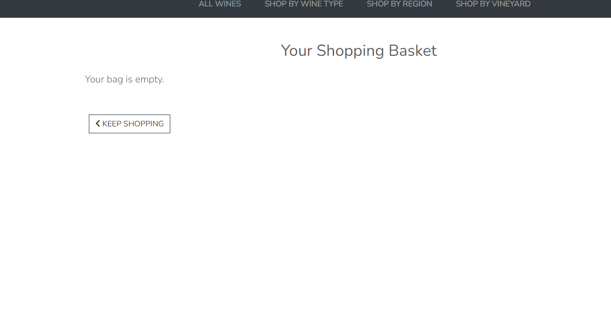
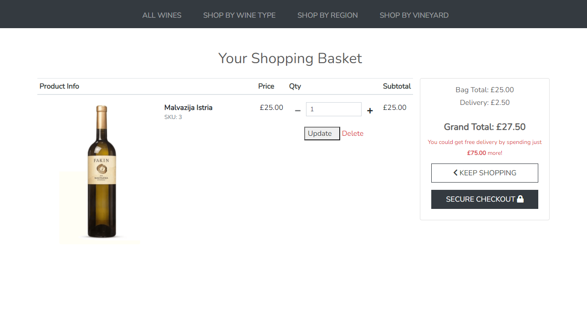
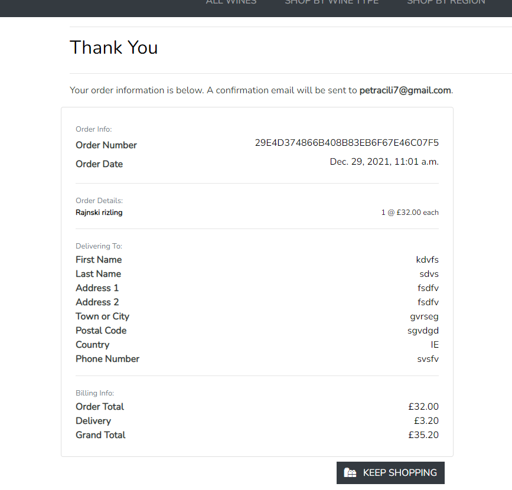

# Full Testing
## Contents
+ [Validator Testing](#validator-testing)
+ [Lighthouse Testing](#lighthouse-testing)
+ [PowerMapper Compatibility](#powermapper-compatibility)
+ [Testing From User Stories](#testing-from-user-stories)
+ [Automated Testing](#automated-testing)
+ [Manually Testing Functionality](#manually-testing-functionality)
+ [Responsive Testing](#responsive-testing)
+ [Bugs and Fixes](#bugs-and-fixes)
+ [Known Bugs](#known-bugs)
---
---
## Validator Testing
### **HTML**

I checked all of the HTML pages using [W3C Markup Validation Service](https://validator.w3.org/)

Errors found & fixed: 
+ Base Tamplate:
   + duplicate ID's

+ Home Page:
   + Alt tags on images

+ Bag Page
   + **The type attribute is unnecessary for JavaScript resources.**(keeping this)

While some of the errors were simple fixes, other were a lot harder to understand how to fix: 

If I remove the id from the widget, the file name won't display when uploaded to the form. 

I can't find where the second id is being generated to be able to remove it or add *id_image* to the widget id. 

**The value of the for attribute of the label element must be the ID of a non-hidden form control.**

This was a lot harder to figure out as none of the form elements are hidden.  

If I had more time I would work on resolving these issue but at this point it's a matter of a deadline, but they're something that I will definitely be going back over.

### **CSS**

I had three CSS files that were checked using [W3C CSS Validation Service](https://jigsaw.w3.org/css-validator/)

### **JavaScript**

I checked the all the JavaScript files using [JSHint](https://jshint.com/)

The code passed all checks.

Because the code comes from Strip itself, I don't want to touch this and am happy to leave it alone. 

### **Python**

I checked the Py files using [PEP8 online](http://pep8online.com/)

The code passed all checks.

---
---

## Lighthouse Testing

After getting the bulk of the site in place, I ran it through Chrome Lighthouse. While all of the elements were in green, I wanted to improve them:

### **Performance**

I made no changes to the performance score. 

### **Accessibility**

I changed the footer ``<h5>`` elements to ``
`` elements which improved the score.

### **Best Practices**

I added ``rel="noopener"`` to the footer Facebook link

### **SEO**

I added a meta decription to the base template. 

---
---

## Automated Testing

Automated Unit Testing was carried out with Djangos testing tools and written to cover as much of the site as possible. Below is an overview of each app and what was tested:

### Bag App

+ Models
   + test the bag url exists
   + test item can be added to bag

### Checkout App

## Manually Testing Functionality
### **Navigation**

|Element               |Action|Expected Result               |Pass/Fail|
|:-------------         |:----|:----------------------------------|:---|
| **NavBar**            |                                         |    |
|Site Name (logo area)  |Click|Redirect to home                   |Pass|
|My profile Dropdown    |Click|Open profile dropdown              |Pass|
|Register Link          |Click|Redirect to register page          |Pass|
|                       |     |(Not visible if user in session)   |Pass|
|Log In Link            |Click|Redirect to log in page            |Pass|
|                       |     |(Not visible if user in session)   |Pass|
|Product Management Link|Click|Redirect to add_product page       |Pass|
|                       |     |(Only visble if admin in session)  |Pass|
|My Profile Link        |Click|Redirect to user profile page      |Pass|
|                       |     |(Only visble if user in session)   |Pass|
|Logout Link            |Click|Redirect to logout confirm  page   |Pass|
|                       |     |(Only visble if user in session)   |Pass|
|Bag Link               |Click|Redirect to bag page               |Pass|
| **SideNav**           |     |                                   |    |
|Hamburger Icon         |Click|Open Sidenav                       |Pass|
|Site Name (logo area)  |Click|Redirect to home                   |Pass|
|My profile Dropdown    |Click|Open profile dropdown              |Pass|
|Register Link          |Click|Redirect to register page          |Pass|
|                       |     |(Not visible if user in session)   |Pass|
|Log In Link            |Click|Redirect to log in page            |Pass|
|                       |     |(Not visible if user in session)   |Pass|
|Product Management Link|Click|Redirect to add_product page       |Pass|
|                       |     |(Only visble if admin in session)  |Pass|
|My Profile Link        |Click|Redirect to user profile page      |Pass|
|                       |     |(Only visble if user in session)   |Pass|
|Logout Link            |Click|Redirect to logout confirm  page   |Pass|
|                       |     |(Only visble if user in session)   |Pass|
|Bag Link               |Click|Redirect to bag page               |Pass|

| **Footer**                |     |                          |    |
|*Customer Care*            |     |                          |    |
|Contact Us Link            |Click|Redirect to contact page  |Pass|
|FAQ's Link                 |Click|Redirect to FAQ's page    |Pass|
|Shipping & Handling Link   |Click|Redirect to FAQ's page    |Pass|
|Returns & Exchanges Link   |Click|Redirect to FAQ's page    |Pass|
|*Socials*                  |     |                          |    |
|Facebook Link              |Click|Open on external page     |Pass|
|Instagram Link             |Click|Open on external page     |Pass|
|Twitter Link               |Click|Open on external page     |Pass|
|TikTok Link                |Click|Open on external page     |Pass|
|*Account*                  |     |                          |    |
|**if user not in session** |     |                          |    |
|Log in Link                |Click|Redirect to login page    |Pass|
|Register Link              |Click|Redirect to signup page   |Pass|
|**if user in session**     |     |                          |    |
|profile Link               |Click|Redirect to profile page  |Pass|
|Log out Link               |Click|Redirect to log out confirmation page|Pass|
|**if admin in session**    |Click|Open on external page     |Pass|
|Product Management Link    |Click|Redirect to add product page|Pass|

---
### **Home Page**
| Element               | Action | Expected Result   | Pass/Fail|
|:-------------         |:-----|:-----                     |:---|
|Hero 'Shop Now' Button |Click |Redirect to products page  |Pass|

---

### **Products Page**

| Element                   | Action | Expected Result         | Pass/Fail |
|:-------------             |:-------|:-----                        |:-----|
|'Sort By' Dropdown         |Click   |Open 'sort by' options          |Pass|
|'Sort By' Options (x6)     |Click   |Re-order products               |Pass|
|If category selected:      |        |                                |Pass|
|Category button            |Click   |                                |Pass|
|Product Card               |Hover   |Box shadow appears              |Pass|
|                           |Click   |Redirect to product detail page |Pass|

---

### **Product Detail Page**

| Element                   | Action | Expected Result         | Pass/Fail |
|:-------------             |:-------|:-----                        |:-----|
|Qty control buttons        |Click   |Increase/decrease quantity    |Pass|
|Keep Shopping button       |Click   |Redirect to products page     |    |
|Add to bag button          |Click   |Add item to bag               |Pass|
|                           |        |Toast Success appears         |Pass|
|                           |        |Item visible in toast success |Pass|
|**If admin in session:**   |        |                              |    |
|Edit product button        |Click   |Redirect to edit product page |Pass|
|Delete product button      |Click   |Open delete confirmation modal|Pass|
|Modal cancel button        |Click   |Close modal                   |Pass|
|Modal delete button        |Click   |Delete product                |Pass|

---

### **Wine Detail Page**

| Element                   | Action | Expected Result         | Pass/Fail |
|:-------------             |:-------|:-----                        |:-----|
|Social Media links         |Click   |Link to external ink on seperate tab |Pass|
|All Wine button         |Click   |Redirect to wine page      |Pass|
|Shop Now button            |Click   |Redirect to products page     |Pass|
|                           |Click   |Redirect to product detail page|Pass|
|**If admin in session:**   |        |                              |    |
|Edit wine button         |Click   |Redirect to edit wine page  |Pass|
|Delete Wine button       |Click   |Open delete confirmation modal|Pass|
|Modal cancel button        |Click   |Close modal                   |Pass|
|Modal delete button        |Click   |Delete wine                 |Pass|

---

### **Wine Page**

| Element                   | Action | Expected Result         | Pass/Fail |
|:-------------             |:-------|:-----                        |:-----|
|'Sort By' Dropdown         |Click   |Open 'sort by' options          |Pass|
|'Sort By' Options (x4)     |Click   |Re-order wine                |Pass|

---

|**If user not in session:**|        |                              |    |
|Video                      |Onload  |Unavailable                   |Pass|
|Login button               |Click   |Video Plays                   |Pass|
|Register button            |Click   |Video Pauses                  |Pass|
|**All users:**             |        |                              |    |
|All Wine button            |Click   |Redirect to wine page      |    |
|**If admin in session:**   |        |                              |    |
|Edit wine button           |Click   |Redirect to edit wine page   |Pass|
|Delete wine button         |Click   |Open delete confirmation modal|Pass|
|Modal cancel button        |Click   |Close modal                   |Pass|
|Modal delete button        |Click   |Delete wine                  |Pass|

---

### **Add Product Page**

| Element                       | Action    | Expected Result                | Pass/Fail |
|:-------------                 |:----------|:-----                          |:-----|
|Form Dropdowns(x2)             |Click      |Show dropdown options           |Pass  |
|Form Text Input (if required)  |Leave blank|On Submit: Warning appears, form won't submit |Pass  |
|Form Text Input (if required)  |Fill In    |On Submit: Form submit          |Pass  |
|Form Text Input         |Just input whitespace|On Submit: Form won't submit |Pass  |
|                               | |On Submit: error message on invalid field |Pass  |
|                               |           |On Submit: error toast appears  |Pass  |
|Form Number field              |Click up/down|increase/decrease value       |Pass  |
|                               |Type into  |Correcct format:Accept value    |Pass  |
|                               |Type into  |Incorrect format:Accept value   |Pass  |
|Form image select button       |Click      |Open device storage             |Pass  |
|                               |           |Chosen image name displayed     |Pass  |
|Cancel button                  |Click      |Redirect to products page       |Pass  |
|Add Product button(form valid) |Click      |Form submit                     |Pass  |
|                               |           |Redirect to product detail page |Pass  |
|                               |           |Product uploaded toast appears  |Pass  |
|Add Product button(form invalid)|Click     |Form doesn't submit             |Pass  |
|                               |           |Error messages on invalid fields|Pass  |

---

### **Edit Product Page**

| Element                       | Action    | Expected Result                | Pass/Fail |
|:-------------                 |:----------|:-----                          |:-----|
|All form fields                |On load    |Populated with original values  |Pass  |
|Form Dropdowns(x2)             |Click      |Show dropdown options           |Pass  |
|Form Text Input (if required)  |Leave blank|On Submit: Warning appears, form won't submit |Pass  |
|Form Text Input (if required)  |Fill In    |On Submit: Form submit          |Pass  |
|Form Text Input                |Just input whitespace|On Submit: Form won't submit|Pass  |
|                               |           |On Submit: error message on invalid field |Pass  |
|                               |           |On Submit: error toast appears  |Pass  |
|Form Number field              |Click up/down|increase/decrease value       |Pass  |
|                               |Type into  |Correct format:Accept value     |Pass  |
|                               |Type into  |Incorrect format:Accept value   |Pass  |
|Form image Select button       |Click      |Open device storage             |Pass  |
|                               |           |New image name displayed        |Pass  |
|Cancel button                  |Click      |Redirect to products page       |Pass  |
|Update Product button(form valid)|Click    |Form submit                     |Pass  |
|                               |           |Redirect to product detail page |Pass  |
|                               |           |Product updated toast appears   |Pass  |
|Update Product button(form invalid)|Click  |Form doesn't submit             |Pass  |
|                               |           |Error messages on invalid fields|Pass  |

---

### **Add Wine Page**

| Element                       | Action    | Expected Result                | Pass/Fail |
|:-------------                 |:----------|:-----                          |:-----|
|Form Text Input (if required)  |Leave blank|On Submit: Warning appears, form won't submit |Pass  |
|Form Text Input (if required)  |Fill In    |On Submit: Form submit          |Pass  |
|Form Text Input         |Just input whitespace|On Submit: Form won't submit |Pass  |
|                               | |On Submit: error message on invalid field |Pass  |
|                               |           |On Submit: error toast appears  |Pass  |
|Form image select button       |Click      |Open device storage             |Pass  |
|                               |           |Chosen image name displayed     |Pass  |
|URL fields                     |Fill In (incorrect format)|On submit:form won't submit|Pass  |
|                               |           |Error message on invalid field  |Pass  |
|                               |Fill In (correct format)|Form submit     |Pass  |
|Cancel button                  |Click      |Redirect to winre page        |Pass  |
|Add wine button(form valid)  |Click      |Form submit                     |Pass  |
|                               |           |Redirect to wine  detail page |Pass  |
|                               |           |wine uploaded toast appears   |Pass  |
|Add wine button(form invalid)|Click      |Form doesn't submit             |Pass  |
|                               |           |Error messages on invalid fields|Pass  |

---

### **Edit wine Page**

| Element                       | Action    | Expected Result                | Pass/Fail |
|:-------------                 |:----------|:-----                          |:-----|
|All form fields                |On load    |Populated with original values  |Pass  |
|Form Text Input (if required)  |Leave blank|On Submit: Warning appears, form won't submit |Pass  |
|Form Text Input (if required)  |Fill In    |On Submit: Form submit          |Pass  |
|Form Text Input         |Just input whitespace|On Submit: Form won't submit |Pass  |
|                               | |On Submit: error message on invalid field |Pass  |
|                               |           |On Submit: error toast appears  |Pass  |
|Form image select button       |Click      |Open device storage             |Pass  |
|                               |           |New image name displayed        |Pass  |
|URL fields                     |Fill In (incorrect format)|On submit:form won't submit|Pass  |
|                               |           |Error message on invalid field  |Pass  |
|                               |Fill In (correct format)|Form submit     |Pass  |
|Cancel button                  |Click      |Redirect to wine page        |Pass  |
|Update wine button(form valid)|Click     |Form submit                     |Pass  |
|                               |           |Redirect to wine  detail page |Pass  |
|                               |           |wine updated toast appears    |Pass  |
|Update wine button(form invalid)|Click   |Form doesn't submit             |Pass  |
|                               |           |Error messages on invalid fields|Pass  |

---

### **Add Wine Page**

| Element                       | Action    | Expected Result                | Pass/Fail |
|:-------------                 |:----------|:-----                          |:-----|
|All form fields                |On load    |Populated with original values  |Pass  |
|Form Dropdown                  |Click      |Show dropdown options           |Pass  |
|Form Text Input (if required)  |Leave blank|On Submit: Warning appears, form won't submit |Pass  |
|Form Text Input (if required)  |Fill In    |On Submit: Form submit          |Pass  |
|Form Text Input         |Just input whitespace|On Submit: Form won't submit |Pass  |
|                               | |On Submit: error message on invalid field |Pass  |

---

### **Edit Wine Page**

| Element                       | Action    | Expected Result                | Pass/Fail |
|:-------------                 |:----------|:-----                          |:-----|
|Form Dropdown                  |Click      |Show dropdown options           |Pass  |
|Form Text Input (if required)  |Leave blank|On Submit: Warning appears, form won't submit |Pass  |
|                               |Fill In    |On Submit: Form submit          |Pass  |
|Form Text Input         |Just input whitespace|On Submit: Form won't submit |Pass  |
|                               | |On Submit: error message on invalid field |Pass  |
|Form Time Input         |Fill in (Incorrect format)|On Submit: Form won't submit |Pass  |

---

### **Bag Page**

| Element                   | Action | Expected Result               | Pass/Fail |
|:-------------             |:-------|:-----                              |:-----|
|**No Bag Items**           |        |                                    |      |
|Shop button                |Click   |Redirect to products page           |Pass  |
|**Bag Items**              |        |                                    |      |
|Qty control buttons        |Click   |Increase/decrease quantity          |Pass  |
|Update button              |Click   |Update bag item quantity            |Pass  |
|                           |        |Updated confirmation toast appears  |Pass  |
|Remove button              |Click   |Remove item from bag                |Pass  |
|                           |        |Removed confirmation toast appears  |Pass  |
|Continue shopping button   |Click   |Redirect to products page           |Pass  |
|Checkout button     |Click (user logged in)|Redirect to checkout page |Pass  |
|       |Click (user not logged in)|Redirect to continue as guest page |Pass  |

---

### **Continue as Guest Page**

| Element                   | Action | Expected Result              | Pass/Fail |
|:-------------             |:-------|:-----                             |:-----|
|Page access      |On load (user logged in)|Redirect to checkout page |Pass  |
|Page access          |On load (user logged in)|Page accessible       |Pass  |
|Sign In button             |Click   |Redirect to log in page            |Pass  |
|Register button            |Click   |Redirect to sign up page           |Pass  |
|Continue as guest button   |Click   |Redirect to checkout page          |Pass  |

---

### **Checkout Page**

| Element                   | Action           | Expected Result                      | Pass/Fail |
|:-------------             |:-----------------|:-----                                     |:-----|
|Page accessible            |Direct URL input (empty bag)|redirect to products page     |Pass  |
|                           |                  |empty bag toast appears                    |Pass  |
|Form fields(if user logged in)|On load |fields populated with user default info(if previously saved)|Pass  |
|Text Input(if required)    |Leave blank       |On submit:form won't submit                |Pass  |
|                           |                  |error message on invalid field(s)          |Pass  |
|                           |Just whitespace   |On submit:form won't submit                |Pass  |
|                           |                  |error message at bottom of page            |Pass  |
|                           |Fill in correctly |On submit: form submits                    |Pass  |
|Phone number Input         |Leave blank       |On submit:form won't submit                |Pass  |
|                           |                  |error message on field                     |Pass  |
|                           |Just whitespace   |On submit:form won't submit                |Pass  |
|                           |                  |error message at bottom of page            |Pass  |
|Email Input                |Leave blank       |On submit:form won't submit                |Pass  |
|                           |                  |error message on field                     |Pass  |
|                           |Just whitespace   |On submit:form won't submit                |Pass  |
|                           |                  |error message at bottom of page            |Pass  |
|                           |Fill in correctly |On submit: form submits                    |Pass  |
|Form Dropdown              |Click             |Show dropdown options                      |Pass  |
|Save to profile checkbox   |On load(user logged in)|Shown                                 |Pass  |
|                           |On load(user not logged in)|Not shown                         |Pass  |
|                           |Checked |On submit:Delivery information saved to user profile |Pass  |
|                     |Unchecked |On submit:Delivery information not saved to user profile |Pass  |
|Payment card input         |Input invalid card number|Error message on field              |Pass  |
|                           |Input invalid card date|Error message on field                |Pass  |
|                           |On load(user not logged in)|Not shown                         |Pass  |
|Adjust Bag button          |Click             |Redirect to bag page                       |Pass  |
|Complete Order button(form invalid)|Click     |Form won't submit                          |Pass  |
|                           |                  |Error message on invalid fields            |Pass  |
|Complete Order button(form valid)|Click       |                                           |      |
|                           |Payment succeeds  |loading screen reappears                   |Pass  |
|                           |                  |form submits                               |Pass  |
|                           |                  |redirect to order confirmation page        |Pass  |
|                           |(if user logged in)|order saved to user profile               |Pass  |
|                           |Payment failed    |Loading animation appears                  |Pass  |
|                           |                  |form won't submit                          |Pass  |
|                           |                  |error message at bottom of form            |Pass  |
|              |Payment Requires authentication|Loading animation appears                  |Pass  |
|                           |                  |Authentication box appears                 |Pass  |
|Fail Authentication button |Click             |Authentication box closes                  |Pass  |
|                           |                  |User directed back to form                 |Pass  |
|                           |                  |error message at bottom of form            |Pass  |
|Complete Authentication button|Click          |loading screen reappears                   |Pass  |
|                           |                  |form submits                               |Pass  |
|                           |                  |redirect to order confirmation page        |Pass  |
|                           |(if user logged in)|order saved to user profile               |Pass  |

---

### **Checkout Success Page**

| Element                   | Action | Expected Result         | Pass/Fail |
|:-------------             |:-------|:-----                        |:-----|
|Shop Again! button         |Click   |Redirect to products page       |Pass|
|View Wine button           |Click   |Redirect to wine page        |Pass|

---

### **Profile Page**

| Element                   | Action           | Expected Result                      | Pass/Fail |
|:-------------             |:-----------------|:------------------------------------------|:-----|
|Form fields         |On load |fields populated with user default info(if previously saved)|Pass  |
|All input fields           |Leave blank       |On submit: form submits                    |Pass  |
|                           |Just whitespace   |On submit: form submits                    |Pass  |
|                           |Fill in correctly |On submit: form submits                    |Pass  |
|Form Dropdown              |Click             |Show dropdown options                      |Pass  |
|Update button              |Click             |Form submits                               |Pass  |
|                           |                  |Form updated toast appears                 |Pass  |
|Previous order number      |Click             |Redirect to previous order page            |Pass  |
* *none of the form fields are required and don't have the same level of validation as the checkout form*
* *If a user uses incorrect profile information on the checkout page, it will be validatied there*

---

### **Previous Order Page**

| Element                   | Action | Expected Result         | Pass/Fail |
|:-------------             |:-------|:-----                        |:-----|
|Toast                  |On load |Previous order info toast appears |      |
|Back to Profile button     |Click   |Redirect to profile page      |Pass  |

---

### **FAQ's Page**

| Element                   | Action | Expected Result         | Pass/Fail |
|:-------------             |:-------|:-----                        |:-----|
|Dropdown #3.Sign up link   |Click (user logged in)|Redirect to home page |Pass  |
|           |Click (user not logged in)|Redirect to sign up page |Pass  |
|Dropdown #11.Contact link  |Click   |Redirect to contact page      |Pass  |
|Page bottom contact link   |Click   |Redirect to contact page      |Pass  |

---

### **Contact Page**

| Element                   | Action | Expected Result         | Pass/Fail |
|:-------------             |:-------|:-----                        |:-----|
|Text Input                 |Leave blank       |On submit:form won't submit                |Pass  |
|                           |                  |error message on invalid field(s)          |Pass  |
|                           |Fill in correctly |On submit: form submits                    |Pass  |
|Email Input                |Leave blank       |On submit:form won't submit                |Pass  |
|                           |                  |error message on field                     |Pass  |
|                           |Just whitespace   |On submit:form won't submit                |Pass  |
|                           |                  |error message at bottom of page            |Pass  |
|                           |Wrong format      |On submit:form won't submit                |Pass  |
|                           |                  |error message on field                     |Pass  |
|                           |Fill in correctly |On submit: form submits                    |Pass  |
|Form Dropdown              |Click             |Show dropdown options                      |Pass  |
|Send button(form invalid)  |Click             |Form won't submit                          |Pass  |
|                           |                  |error message on invalid field(s)          |Pass  |
|Send button(form valid)    |Click             |Form submits                               |Pass  |
|                           |                  |Mail sent toast appears                    |Pass  |
|                           |                  |Email notificaiton sent to admin           |Pass  |

---

### **Allauth Pages**

| Element                   | Action | Expected Result                   | Pass/Fail |
|:-------------             |:-------|:---------------------------------------|:-----|
|**Register**               |        |                                        |      |
|Sign in link               |Click   |Redirect to sign in page                |Pass  |
|*Form*                     |        |                                        |      |
|Email field        |Fill in (incorrect format)|On submit: form wont'submit|Pass  |
|                           |        |Error message on invalid field          |Pass  |
|                          |Fill in (correct format)|On submit: form submit|Pass  |
|                 |Fill in (email already used)|On submit: form wont'submit|Pass  |
|                           |        |Error message on invalid field          |Pass  |
|                  |Fill in (email not already used)|On submit: form submit|Pass  |
|Username field       |Fill in (all whitespace)|On submit: form wont'submit|Pass  |
|                           |        |Error message on invalid field          |Pass  |
|                          |Fill in (correct format)|On submit: form submit|Pass  |
|              |Fill in (username already used)|On submit: form wont'submit|Pass  |
|                           |        |Error message on invalid field          |Pass  |
|               |Fill in (username not already used)|On submit: form submit|Pass  |
|Password field         |Fill in (incorrect format)|On submit: form wont'submit|Pass  |
|                       |            |error message on invalid field          |Pass  |
|                     |Fill in (correct format)|On submit: form wont'submit|Pass  |
|              |Fill in (passwords don't match)|On submit: form wont'submit|Pass  |
|                           |        |error message on invalid field          |Pass  |
|                         |Fill in (passwords match)|On submit: form submit|Pass  |
|Sign Up button(form invalid)|Click  |Form wont'submit                        |Pass  |
|                           |        |error message on invalid fields         |Pass  |
|Sign Up button(form valid) |Click   |Form submit                             |Pass  |
|                           |        |redirect to email verification page     |Pass  |
|                           |        |email sent to user                      |Pass  |
|**Email Verification**     |        |                                        |      |
|Follow link from email     |Click   |redirect to confirm email page          |Pass  |
|Confirm button             |Click   |redirect to log in page                 |Pass  |
|                           |        |sign in form populated with user info   |Pass  |
|                           |        |email confirmation toast appears        |Pass  |
|**Login**                  |        |                                        |      |
|Sign up link               |Click   |Redirect to sign up page                |Pass  |
|*Form*                     |        |                                        |      |
|Username Field     |Fill in (just whitespace)|On submit:form won't submit |Pass  |
|                           |        |error message on invalid field          |Pass  |
|                    |Fill in (wrong username)|On submit:form won't submit |Pass  |
|                           |        |error message for username/password     |Pass  |
|Password Field     |Fill in (just whitespace)|On submit:form won't submit |Pass  |
|                           |        |error message on invalid field          |Pass  |
|                    |Fill in (wrong password)|On submit:form won't submit |Pass  |
|                           |        |error message for username/password     |Pass  |
|Forgot Password button     |Click   |redirect to password reset page         |Pass  |
|Sign In button(form invalid)|Click  |form won't submit                       |Pass  |
|                           |        |error message on invalid field(s)       |Pass  |
|Sign In button(form valid) |Click   |form submit                             |Pass  |
|                           |        |redirect to home page                   |Pass  |
|                           |        |sign in confirmation toast appears      |Pass  |
|**Password Reset**         |        |                                        |      |
|Email Field        |Fill in (just whitespace)|On submit:form won't submit |Pass  |
|                           |        |error message on invalid field          |Pass  |
|                |Fill in (incorrect email)|On submit:form won't submit    |Pass  |
|                           |        |error message on invalid field          |Pass  |
|                           |Fill in (correct email)|On submit:form submit |Pass  |
|Forgot Password button     |Click   |redirect to password reset page         |Pass  |
|Reset password button(form invalid)|Click  |form won't submit                |Pass  |
|                           |        |error message on invalid field          |Pass  |
|Reset password button(form valid)|Click  |form submit                        |Pass  |
|                           |        |redirect to password reset confirmation |Pass  |
|                           |        |email sent to user                      |Pass  |
|**Change Password**        |        |                                        |      |
|Password reset link from email|Click|redirect to change password page        |Pass  |
|Password input     |Fill in (all whitespace)|On submit: form won't submit |Pass  |
|                           |        |error message on field                  |Pass  |
|           |Fill in (passwords not matching)|On submit: form won't submit |Pass  |
|                           |        |error message on field                  |Pass  |
|                        |Fill in (passwords match)|On submit: form submit |Pass  |
|Change password button(form invalid)|Click|Redirect to change password confirmation|Pass  |
|                           |      |Password change confirmation toast appears|Pass  |
|**Logout Confirmation**    |        |                                        |      |
|Sign out button            |Click   |Redirect to homepage                    |Pass  |
|                           |        |Sign out confirmation toast appears     |Pass  |

---
---
## Responsive Testing
Through devices that I have at home/readily available to me, I was able to continuously test on:
### Phone:
+ Samsung Galaxy S9
  + Google Chrome
  + Samsung Internet
+ Huawei Y7
  + Google Chrome
+ iPhone 6
  + Safari
### Tablet
+ iPad Mini 7.9"
  + Safari
+ iPad 9.7"
  + Safari
### Computer
* Avita Pura 14" Laptop
  * Google Chrome
  * Microsoft Edge
  * Opera
  * Mozilla Firefox
### Responsinator
+ When there were devices/browsers that I didn't have access to, I used [Responsinator](https://www.responsinator.com/) to make sure that the site was responsive.

---
---

